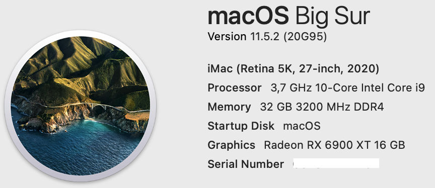
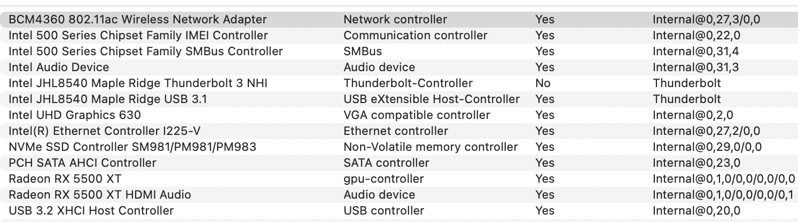
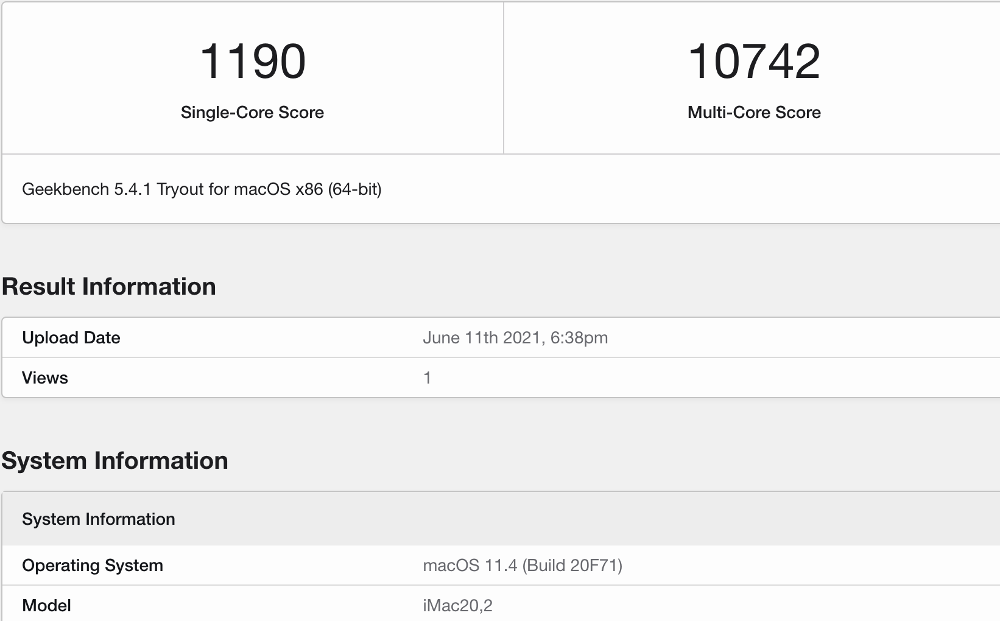
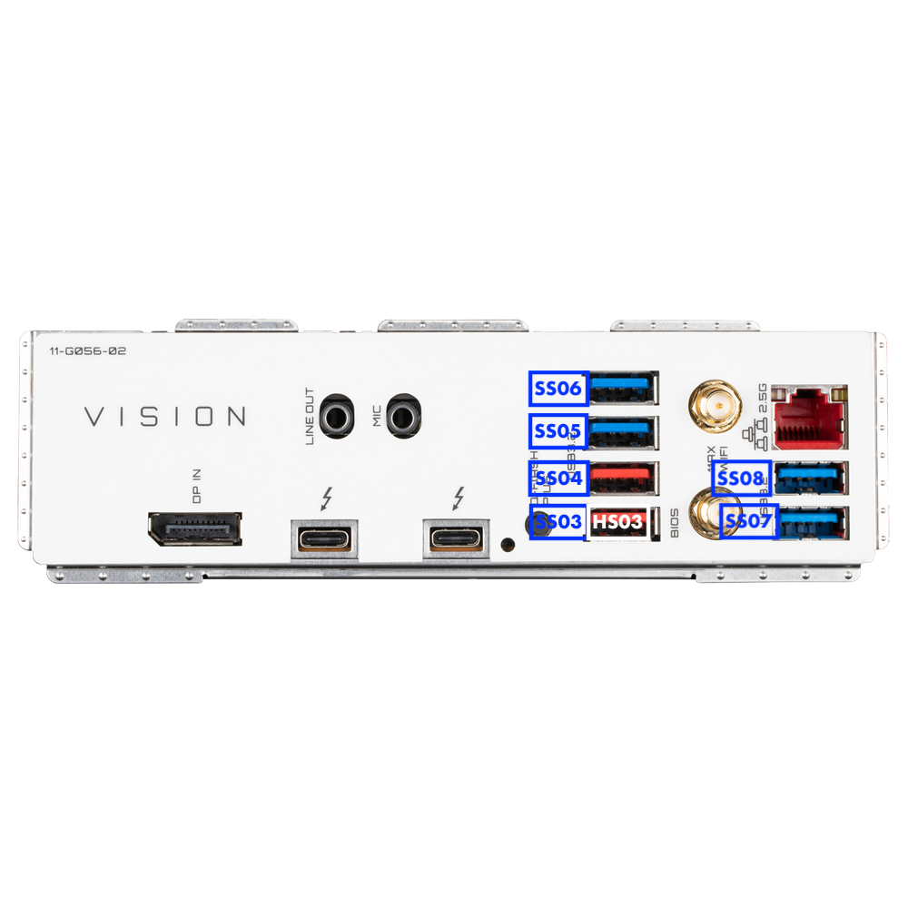
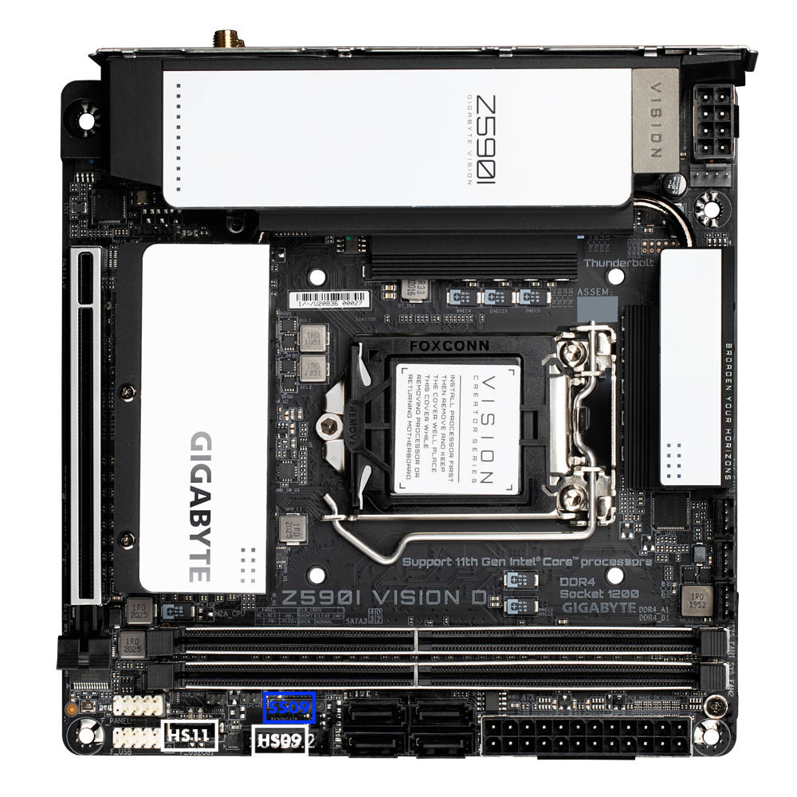

# Gigabyte-Z590i-Vision-D-10900K
 

  
 

 

  
 

  

  
 

 ## Specs
 | **Component** | **Model** |
| ------------- | --------- |
| CPU | i9-10900K @ 5.3GHz |
| RAM | DDR4 32GB (2x16GB) 3200MHz Crucial Ballistix White RGB |
| Audio Chipset | Realtek ALC4080. Works OOB as it is connected as USB-Audio interface |
| dGPU | MSI RX 5500 XT Gaming X 8GB. Works OOB with boot agrument agdpmod=pikera |
| iGPU | Intel UHD Graphics 630 |
| WiFi & Bluetooth | BCM94360NG Works OOB. Fits into original Intel card slot |
| Lan |  Intel® 2.5GbE LAN I225-V. Works OOB on Big Sur 11.5.2 with boot argument dk.e1000=0 |
| OS Disk | 512GB Samsung 850 Pro SATA |
| macOS | Big Sur 11.5.2/OpenCore 0.7.3

## BIOS
- Press Del to enter the BIOS. Use latest available bios for this board which F5.
- Enable XMP Profile1.
- Set Legacy USB to Auto.
- Enable Internal graphics and set DVMT Pre-Allocated to 128MB, Total GFX memory to MAX.
- CFG Lock is disabled and CSM Support is disabled.
- The rest of the settings can be left at their defaults.

## USB issue
Because XhciPortLimit kernel quirk no longer works on the latest Big Sur 11.3.x and above, we are left with 15 ports max. I have made a custom USBPorts.kext where I adjusted the ports in such a way, that bottom two USB ports would not work at all. Top four in a row would all work as USB 3.x, but only three of them would work as USB 2.0. See the pictures below. USB-C motherboard header works with 3.x and 2.0 devices. Motherboard USB3.2 header has two ports, but I am using only one because my case has only one front panel USB 3.0 port.
 

  
 

 

  
 

## Opencore
- Fill in your own PlatformInfo. For Big Sur use iMac20,2 SMBIOS.

