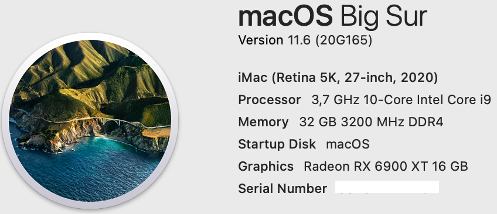

# Gigabyte-Z590i-Vision-D-10900K
 

  
 

 

  
 

 ## Specs
 | **Component** | **Model** |
| ------------- | --------- |
| CPU | i9-10900K @ 5.3GHz |
| RAM | DDR4 32GB (2x16GB) 3200MHz Crucial Ballistix White RGB |
| Audio Chipset | Realtek ALC4080. Works OOB as it is connected like a USB-Audio interface |
| dGPU | MSI RX 5500 XT Gaming X 8GB. Works OOB with boot agrument agdpmod=pikera |
| iGPU | Intel UHD Graphics 630 |
| WiFi & Bluetooth | BCM94360NG Works OOB. Fits into original Intel card slot |
| Lan |  Intel® 2.5GbE LAN I225-V |
| OS Disk | 512GB Samsung 850 Pro SATA |
| macOS | Big Sur 11.4/OpenCore 0.6.9

## BIOS
- Press Del to enter the BIOS. Use latest available bios for this board which F5d as of this writing.
- Enable XMP Profile1.
- Disable Legacy USB.
- Enable Internal graphics and set DVMT Pre-Allocated to 128MB, Total GFix memory to MAX.
- The rest of the settings can be left at their defaults. Make sure though that CFG Lock is disabled and CSM Support is disabled.

## Installation issue
I could not install macOS on this board the normal way. I was getting a boot loop after the second reboot during the install process.
What I finally did was to install the macOS on an external USB SSD enclosure on anther hackintosh. After OS was fully installed, I popped the SSD into my new system and was able to boot successfully.

## USB issue
Because XhciPortLimit kernel quirk no longer works on the latest Big Sur 11.3.x, we are left with 15 ports max. I have made a custom USBPorts.kext where I adjusted USB-A 3.0 ports on the back plane to be 5GB only. USB 2.0 devices will work only in one port that is marked BIOS. USB-C motherboard header works with 3.0 and 2.0 devices. Motherboard USB3.2 header has two ports, but I am using only one because my case has only one front panel USB 3.0 port. See pictures below for detailed port configuration.
 

  
 

 

  
 

## Opencore
- Fill in your own PlatformInfo. For Big Sur use iMac20,2 SMBIOS.

