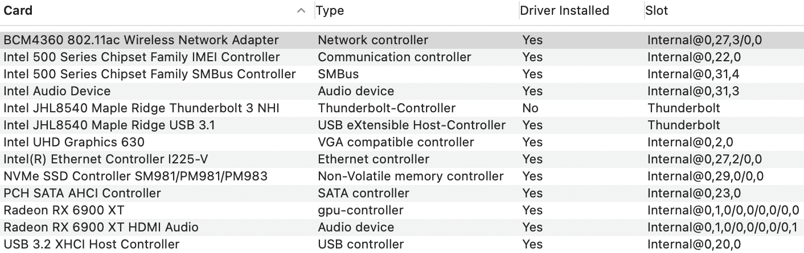

# Gigabyte-Z590i-Vision-D-10900K
 

  
 

 

  
 

 ## Specs
- CPU i9-10900K 10 cores and 20 threads.
- RAM DDR4 32GB (2x16GB) 3200MHz Ballistix White RGB.
- SSD 256GB 850 PRO Samsung SATA.
- WiFi/Bluetooth BCM94360NG card. Works out of the box. No kexts needed. Fits into the slot under the heat sink. Original antennas work just fine.
- dGPU MSI RX 5500 XT Gaming X 8GB. Works with Lilu.kext and WhateverGreen.kext and boot argument agdpmod=pikera.

## BIOS
- Press Del to enter the BIOS. Use latest available bios for this board which F5d as of this writing.
- Enable XMP Profile1.
- Disable Legacy USB.
- Enable Internal graphics and set DVMT Pre-Allocated to 128MB, Total GFix memory to MAX.
- The rest of the settings can be left at their defaults. Make sure though that CFG Lock is disabled and CSM Support is disabled.

## Opencore
- Version 0.6.8
- Fill in your own PlatformInfo. For Big Sur use iMac20,2 SMBIOS.

