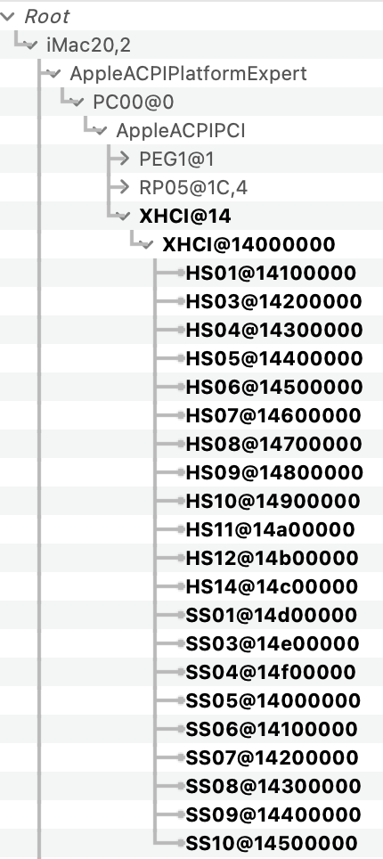
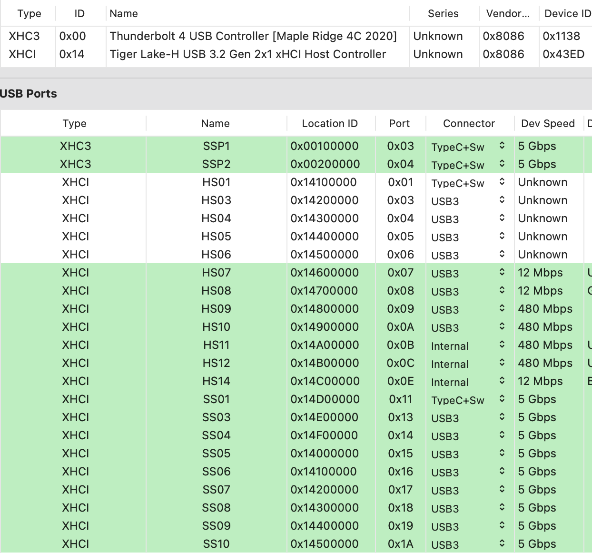
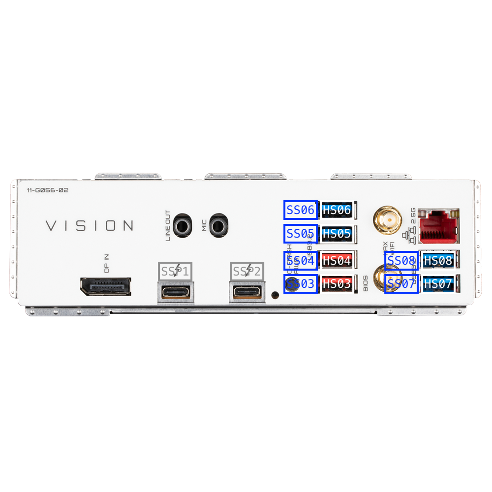
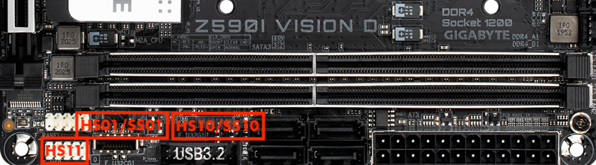

# Gigabyte-Z590i-Vision-D-10900K
 

  
 

 

  
 

  

  
 

  

  
 

 ## Specs
 | **Component** | **Model** |
| ------------- | --------- |
| CPU | i9-10900K @ 5.3GHz |
| RAM | DDR4 32GB (2x16GB) 3200MHz Crucial Ballistix White RGB |
| Audio Chipset | Realtek ALC4080. Works OOB as it is connected as USB-Audio interface |
| dGPU | ASUS ROG-STRIX-LC-RX6900XT-T16G-GAMING. Works with boot agrument agdpmod=pikera plus device-id swap and ACPI table SSDT-BRG0.aml |
| iGPU | Intel UHD Graphics 630 |
| WiFi & Bluetooth | BCM94360NG Works OOB. Fits into original Intel card slot |
| Lan |  Intel® 2.5GbE LAN I225-V. Works OOB on Big Sur with boot argument dk.e1000=0 |
| OS Disk | 512GB Samsung 850 Pro SATA |

## BIOS
- Press Del to enter the BIOS. Use latest available bios for this board which F5.
- Enable XMP Profile1.
- Set Legacy USB to Auto.
- Enable Internal graphics and set DVMT Pre-Allocated to 128MB, Total GFX memory to MAX.
- CFG Lock is disabled and CSM Support is disabled.
- The rest of the settings can be left at their defaults.

## USB issue
I have made a custom USB-z590i.kext that should be used together with XhciPortLimit kernel quirk. All ports should be working, but I could not get three ports to work wit USB 2.0 devices, i.e. HS01, HS03 and HS04. They all apper in IOReg and Hackintool though.
 

  
 

 

  
 

 

  
 

 

  
 

## Opencore
- Fill in your own PlatformInfo. For Big Sur use iMac20,2 SMBIOS.
